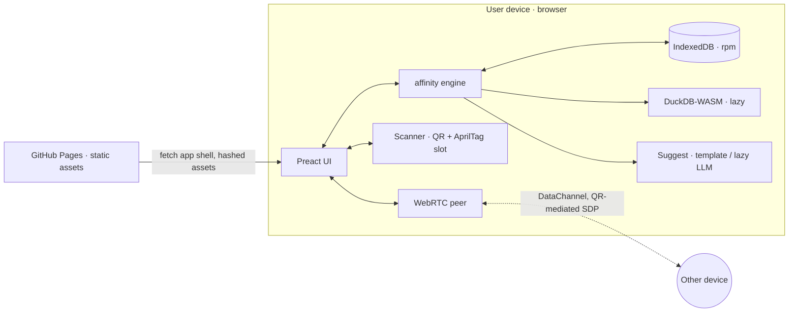

# Architecture

## Boundaries

- Pages serves the **app shell** (HTML, hashed JS/CSS, manifest, SW).
  No runtime API. No third-party origin hit during normal use.
- All user data lives in **IndexedDB** on the device. The seed data set
  is hard-coded in the bundle for first-run demos.
- Peer exchange is **explicit and ephemeral**. Two devices set up a
  WebRTC DataChannel, exchange one `AffinityVector` each, and close the
  channel. The exchange is not retried automatically.

See ADRs in `docs/adr/`.
